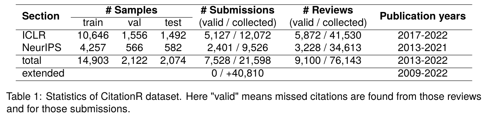

# RMC - Recommending Missed Citations Identified by Reviewers

This repository contains datasets and code for our COLING 2024 paper:
["Recommending Missed Citations Identified by Reviewers: A New Task, Dataset and Baselines"](http://arxiv.org/pdf/2403.01873.pdf).


## The CitationR Dataset



[CitationR](./data/base) is created by extracting recommended citations in reviews from NeurIPS and ICLR.
In total, we collect 76,143 official reviews and 21,598 submissions, among which around 35% of submissions are identified as lacking citations.
Moreover, to better replicate the actual situation in which researchers search for papers to cite, we establish [a larger and more challenging version](./data/extended) of CitationR. 
This version includes additional 40,810 papers published in top venues that reviewers frequently recommend citations from.

Download the base version from the following link: [Baidu Drive](https://pan.baidu.com/s/1TOIJ-_Tpyvdiqh7c7hDFbQ?pwd=q2vy) (access code: q2vy)

Download the extended version from the following link: [Baidu Drive](https://pan.baidu.com/s/13CE2Q28zW5pAz94pSO-JUA?pwd=gjwu) (access code: gjwu)


## Setup
### Data Preparation
Unzip downloaded data and put them under `data/` with names of `base` and `extended` respectively.

### Environment Setup
```bash
conda create -n rmc python==3.7.12
source activate rmc
pip install -r requirements.txt
```


## Baselines

### BM25
* Evaluation
```bash
python ./src/bm25.py
```


### Citeomatic
Follow official introduction in [citeomatic](https://github.com/allenai/citeomatic)

### HTransformer
Follow official introduction in [Local-Citation-Recommendation](https://github.com/nianlonggu/Local-Citation-Recommendation)

### Pre-trained LM (BERT, SciBERT, SPECTER, CiteBERT, LinkBERT, SciNCL ...)
* Evaluation of LMs not fine-tuned on CitationR
```bash
python ./src/evaluating/direct_plm_evaluating.py --dataset_name base --model_name scincl --way_ref concat
```

* Evaluation of LMs fine-tuned on CitationR
```bash
python ./src/evaluating/evaluate.py --dataset_name base --config_name example --experiment_name example_evaluation
```

* Train
```bash
python ./src/training/run_training.py --model scincl --dataset base --config_name example --experiment_suffix example_train
```

Our fine-tuned models are available: [base](https://pan.baidu.com/s/1jfmYX3fftWb8PCd29JLJNQ?pwd=nrbe)(access code: nrbe), [extended](https://pan.baidu.com/s/1E6FNJLKoqxUujUI-g6Xe2A?pwd=n3pb)(access code: n3pb).

Put downloaded models under `experiments/dataset_name/example_evaluation/model/`

## Citation
If you find our work useful, please cite the paper as:
```bibtex
@inproceedings{long24coling,
  title = {Recommending Missed Citations Identified by Reviewers: A New Task, Dataset and Baselines},
  author = {Kehan Long and Shasha Li and Pancheng Wang and Chenlong Bao and Jintao Tang and Ting Wang},
  booktitle = {COLING},
  year = {2024}
}
```

## Acknowledgement
 - We use some of the code in [Local-Citation-Recommendation](https://github.com/nianlonggu/Local-Citation-Recommendation) and [specter](https://github.com/allenai/specter) for implementing our project.